# SpringBoot JWT Project

Name: Le Tuan Kiet  
StudentID: 22024546

## User
### Create new user POST /auth/user
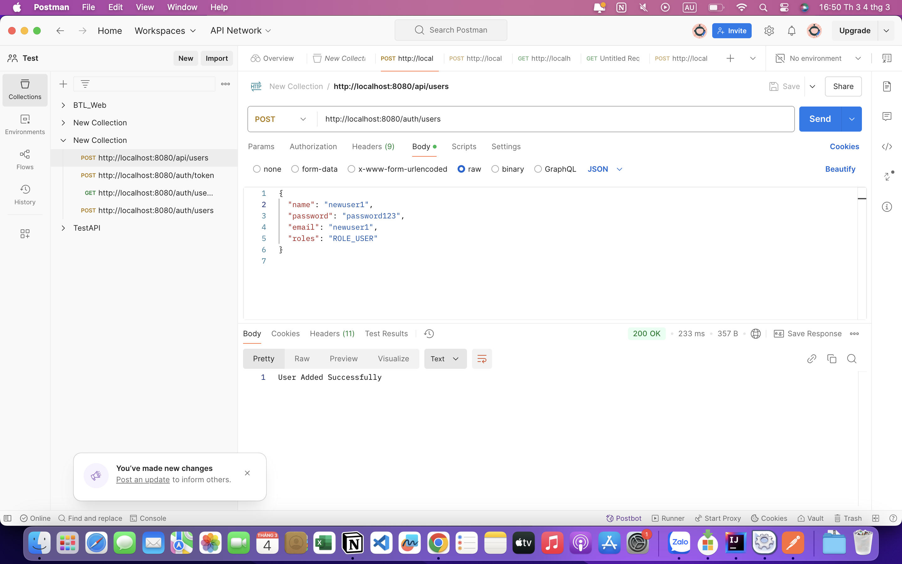
### Generate user's token POST /auth/token/

### Get users' profile through token GET /auth/user/profile
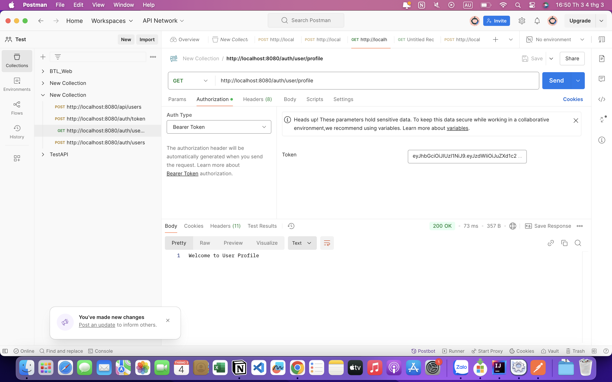

### User CAN access GET /auth/accounts
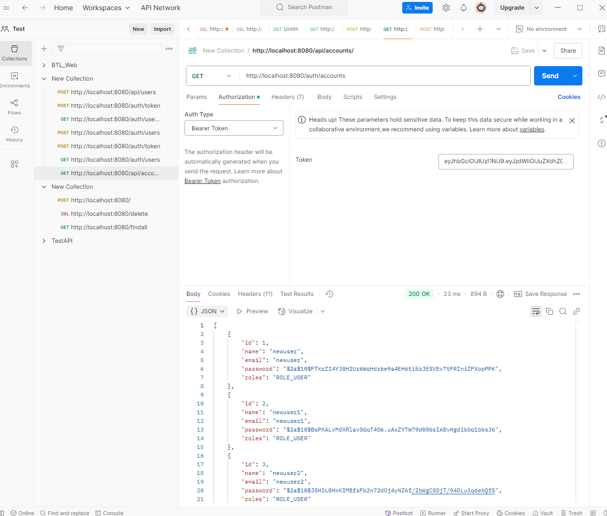

### User CAN NOT access PUT /auth/accounts/{id}
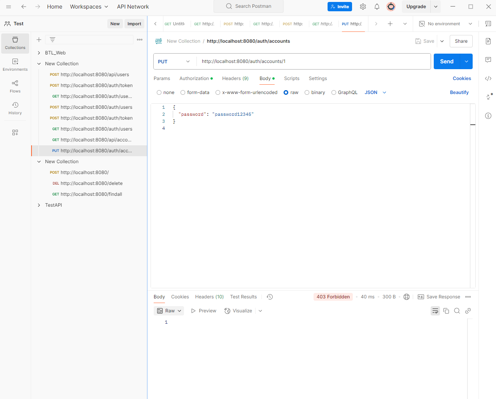

### User CAN NOT access DEL /auth/accounts/{id}
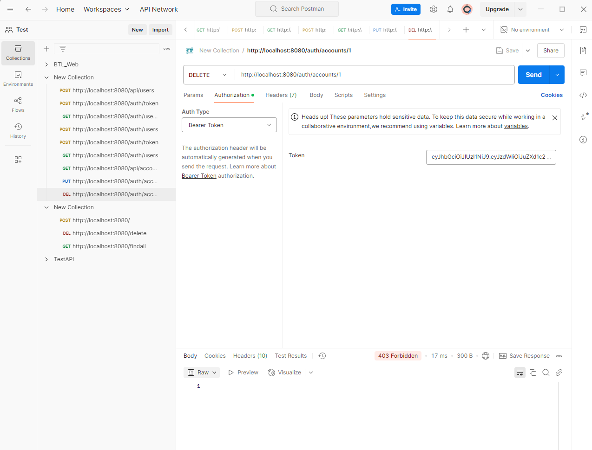

## Admin
### Create new admin POST /auth/user
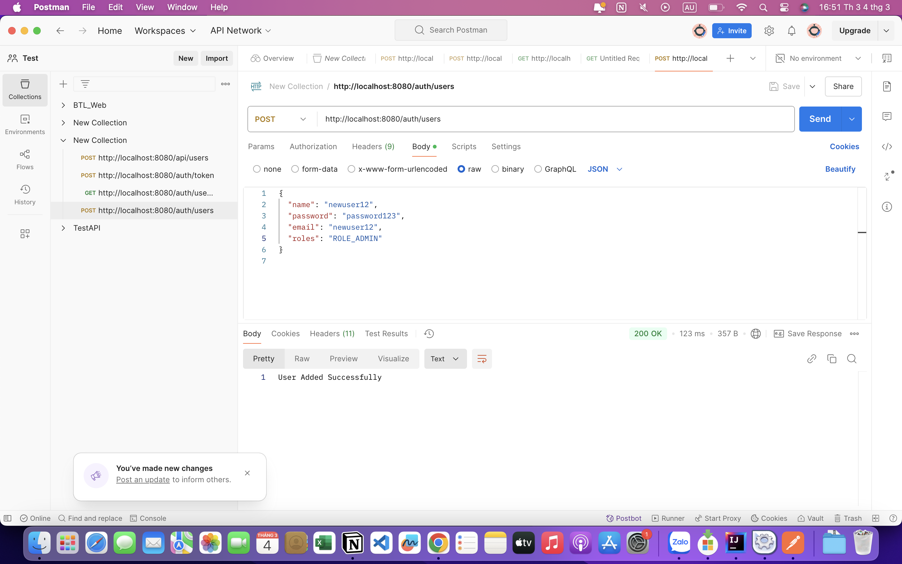
### Generate admin's token POST /auth/token/
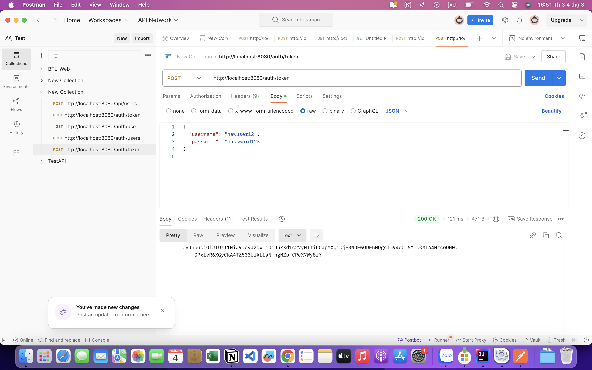
### Get admin's profile through token GET /auth/admin/profile
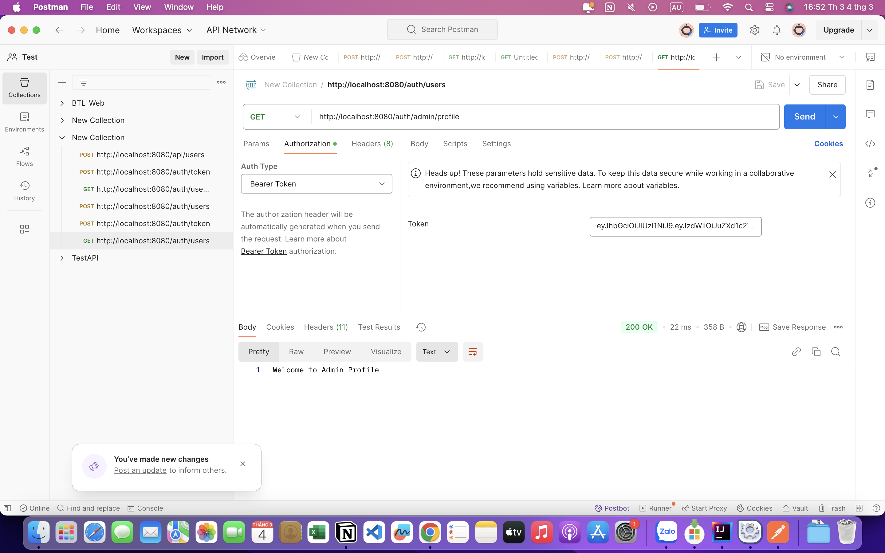

### ADMIN CAN access GET /auth/accounts
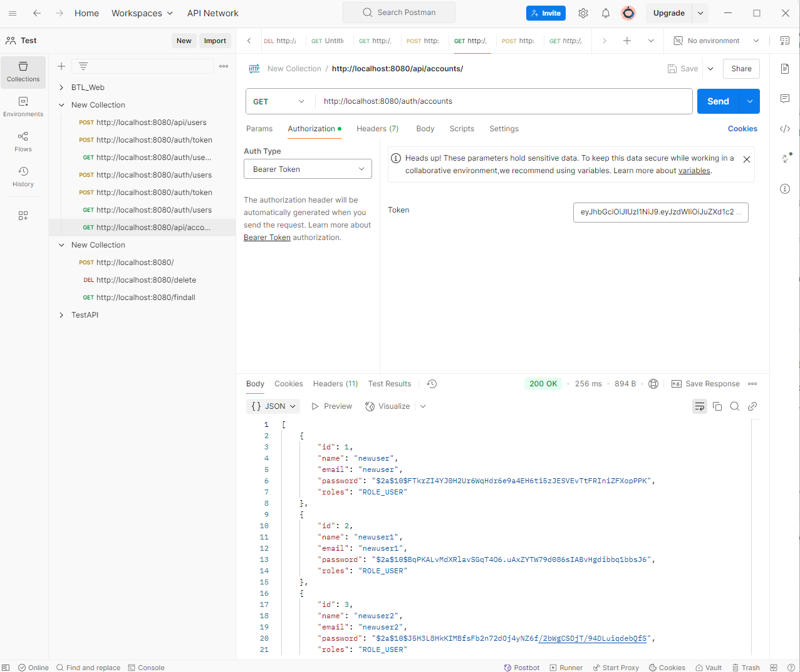

### ADMIN CAN access PUT /auth/accounts/{id}
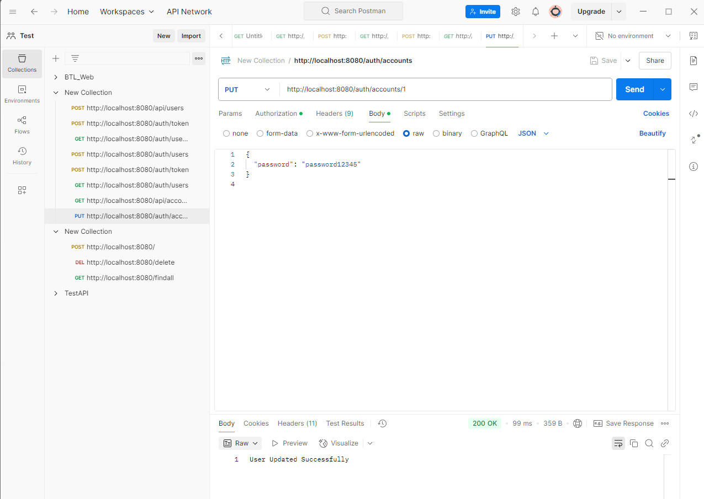
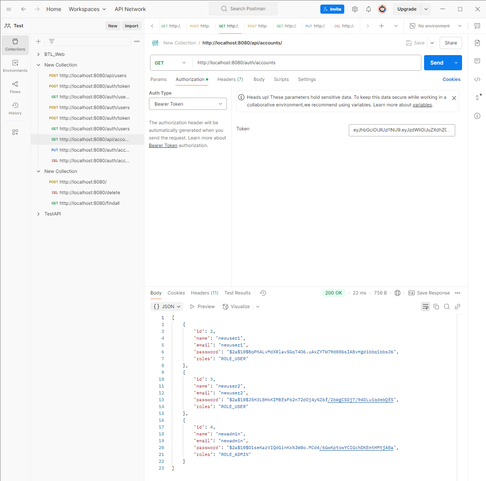
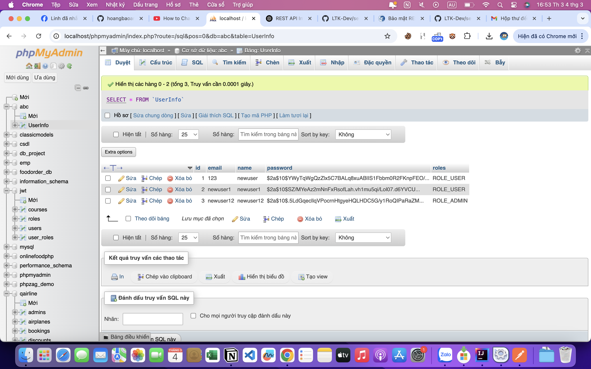
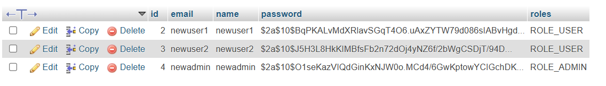

### ADMIN CAN access DEL /auth/accounts/{id}
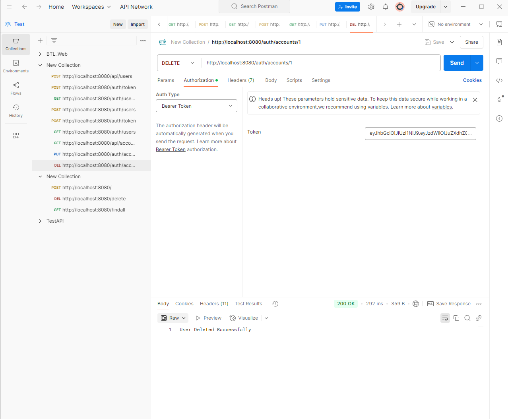

## Database

