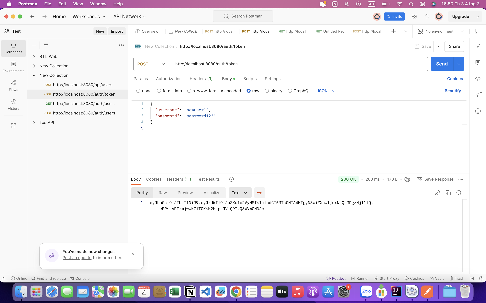

# SpringBoot JWT Project

Name: Le Tuan Kiet
StudentID: 22024546

## User
### Create new user POST /auth/user

### Generate user's token POST /auth/token/

### Get users' profile through token GET /auth/user/profile

## Admin
### Create new admin POST /auth/user

### Generate admin's token POST /auth/token/

### Get admin's profile through token GET /auth/admin/profile

## Database
